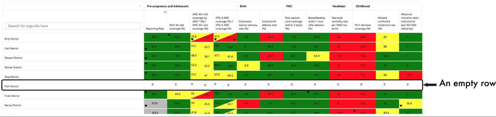

# Additional options

Scorecard application allows user to Customize the look of scorecard.
add numbering, ranking, hide/show legend, average column and row.

Scorecard options can be modified in the viewing or the creation
interfaces by clicking the “Options” button.

Options are divided in three sections: Show/Hide, Best/Worst and
Average.

> **NOTE**
>
> To keep options permanently visible, click on the options button, this
will keep options menu permanently accessible for changes, click again
on options to close it when leaving the menu.

## Hide/show legend

To show the legend, make sure the Legend checkbox is checked.

To hide the legend, make sure the Legend option is unchecked.  

Figure 6.1-A: The legend displaying on top of the scorecard

## Hide/show item number

To show the item number, make sure the Item Number checkbox is checked.

To hide the item number, make sure the Item Number option is unchecked.
 

> **NOTE**
>
> Item number is always ascending following the current column used for
sorting, which will contain up/down arrow indicating column used for
sorting in ascending/descending order

 

## Hide/show empty rows

To show empty rows, make sure the Empty Rows checkbox is checked.

Figure 6.3-A: Scorecard with empty row on organization units

To hide the empty rows, make sure the Empty Rows option is unchecked.  

Figure 6.3-B: Scorecard with hidden empty rows

## Hide/show average row/column

To show average row or average column, make sure the Average Column or
Average Row checkbox, respectively is checked.

To hide average row or average column, make sure the Average Column or
Average Row checkbox, respectively is unchecked.

> **NOTE**
>
> Average columns may not always make sense depending on set of indicators
under display, it only make sense mostly when values are of the same
nature or range, e.g. percentage or client counts.

## Hide/show below/above average

To show below average or above average performance, make sure the below
average or the above average checkbox, respectively is checked.

To hide below average or above average performance, make sure the below
average or the above average checkbox, respectively is unchecked.

> **NOTE**
>
> The Average values used is by default to sort scorecard rows for
hiding/showing above and below average are based on column used for
sorting(sorted column), if sorted column is organization unit, average
column is used.

## Show top ten/five/three

To show top ten/five or three performance, make sure the ten/five or
three checkbox, respectively is checked.

To hide top ten/five or three performance, make sure the below average
or the above average checkbox, respectively is unchecked.

> **NOTE**
>
> Top ten/five/three is based on sorted column, which by default is
organization unit column.

## Download Scorecard

You can download the scorecard in excel format by clicking, the “Excel”
button. This shall download the scorecard in csv format and you can
perform any desired operations on an excel file handling application
offline. The “excel” button can be spotted on top of the scorecard
header next to the edit button.

## Print Scorecard

To print the scorecard simply click the Print button.

> **NOTE**
>
> To hide headers and footer containing page url or page name, and get
colored PDF document.
>
>  - On Chrome browsers, Expand “More settings” and untick headers and
>    footer,  choose destination printer to “Save as PDF” to download
>    colored PDF document.
>  - On Firefox, open “Options” tab and set header and footer to
>    “--blank--”, choose destination printer to “Print to file” to
>    download colored PDF document.

