# Analysis with scorecard

Once the scorecard is open, you can analyze the data visualized by the
scorecard through different dimensions using various components offered
by the scorecard app.

## Navigating the scorecard

For analysis purposes the scorecard app allows you to

  - Switch between organization units and period types
  - Switch between layouts on the fly
  - Show and Hide some components and data
  - Print and Download scorecard
  - Sort by data values in ascending and descending orders
  - Performing Trend and Bottleneck analysis

All explained in this chapter.

## Drill down analysis

Scorecards support drill down analysis from scorecard rows, where row
headers can be clicked to reveal lower level of analysis. By default
scorecard lists organization units in rows and data in columns, thus
default drill down analysis accessible to user is by organization units.

Data in columns can be moved to rows with drag and drop layout change,
thus supporting drag and drop on indicators in rows, where organization
units will be moved to columns.

> **NOTE**
>
> Drill down on indicators is only supported for indicators with related
indicators assigned to them.

### Drill down analysis by Organization units

In order to drill down across organization unit levels just click the
name of the children organization level and the scorecard of the
particular organization unit will appear under the row of that
organization.

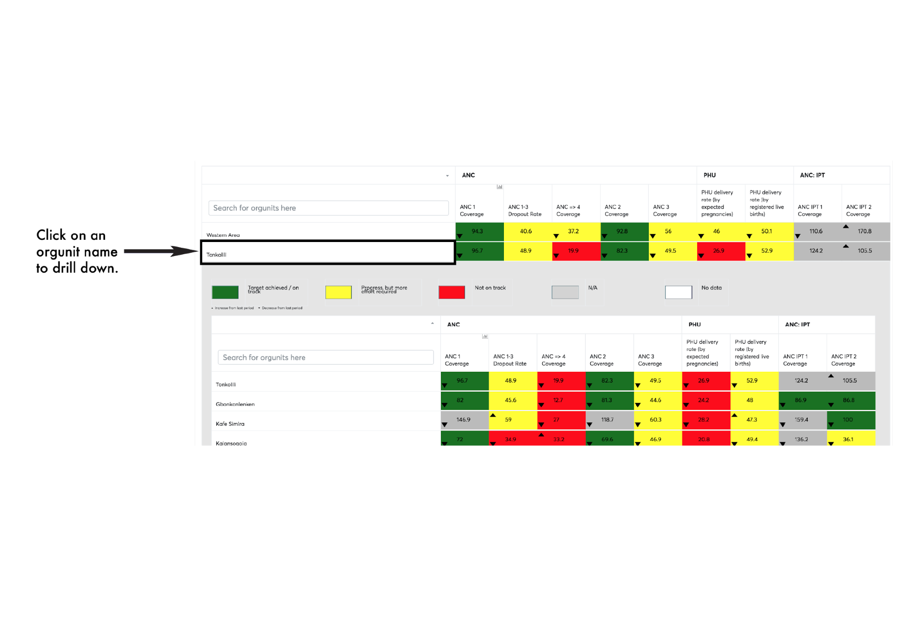

### Drill down analysis by Data

In order to drill down across data, indicators names/headings needs to
be on the rows of the scorecard, this can be achieved by drag and drop
of indicators heading from columns to rows and clicking of row
headers(indicator names) to drill down.

Among use cases of drill down analysis by indicators includes mapping of
performance from bottleneck chart to scorecard.

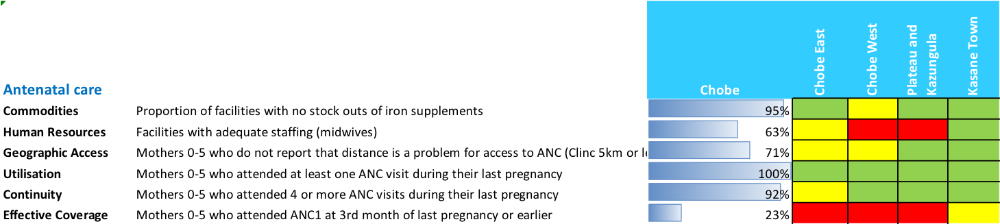

Only indicators with related indicators will support drill down
analysis, thus only indicators with related indicator analysis icon will
have drill down capability showing the related indicators on lower
level, if any of the lower level indicators also have related indicators
assigned to them, drill down can proceed further down.

With utilization of scorecard layout change feature (see scorecard
layouts chapter) and support related indicator analysis through related
indicators analysis by individual indicator selections , When  viewing
the scorecard at a parent level, you can drill down to see scorecard of
children levels.

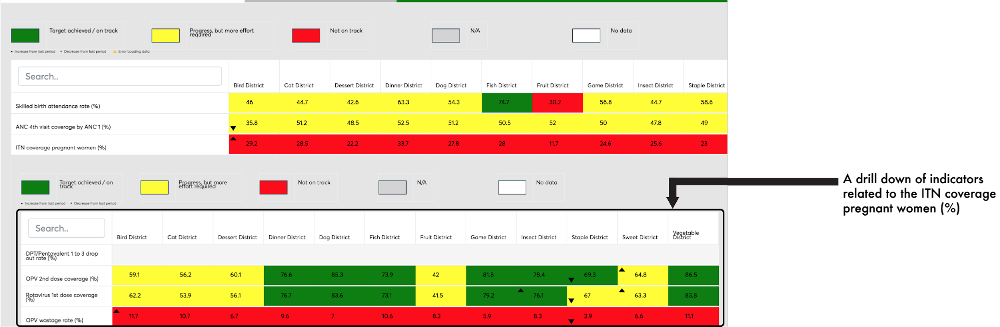

## Organization unit selection

The Scorecard app allows you to make organization unit selections based
on groups, levels and user organization units, these are known as
selection modes.

All organization unit selections types begin with clicking the select
option button that displays the selected organization unit. Then click
the branching icon.

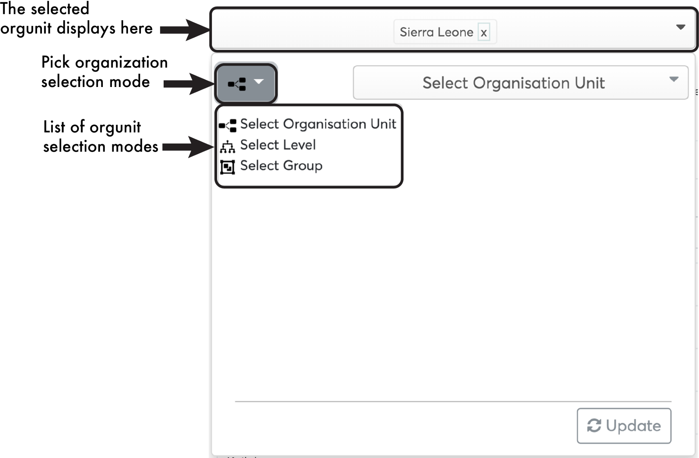

### Selection by levels

From the selection mode dropdown menu click “Select Level” then navigate
to the button on the right that reads “Select Organization Unit Levels”,
from the dropdown list of Levels, you can then make your selections by
clicking the desired levels to view on your scorecard.

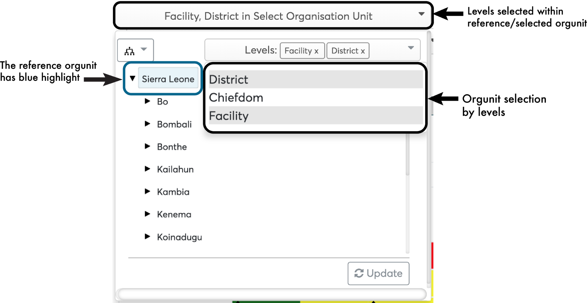

### Selection by groups

From the dropdown menu that appears click “Select Group” then navigate
to the button on the right that reads “Select Organization Units Group”,
from the dropdown list of Groups, you can then make your selections by
clicking the desired groups to view on your scorecard.

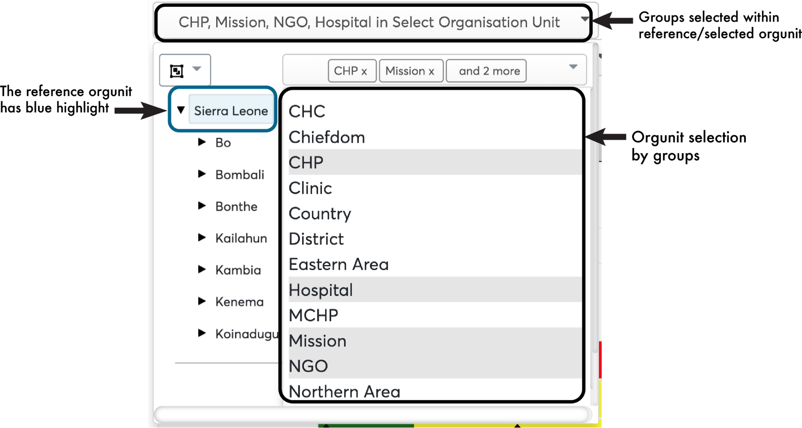

### Selection by user organization unit

From the dropdown menu that appears click “Select Organization Unit”
then navigate to the button on the right that reads “Select Organization
Unit”, from the dropdown list, you can then make your selections with
respect to your organization by clicking the desired option unit to view
on your scorecard.

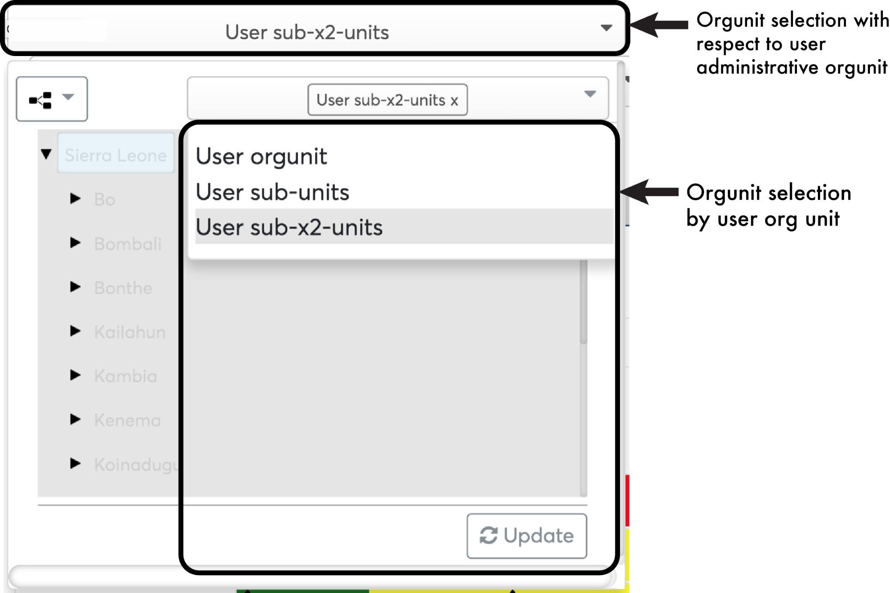

## Period selection

The scorecard app allows you to make period selections for fixed
periods, relative periods and extended relative periods.

All period selections types begin with clicking the select option button
that displays the starting period. Then clicking on the period type
select option button which lists all the period types.

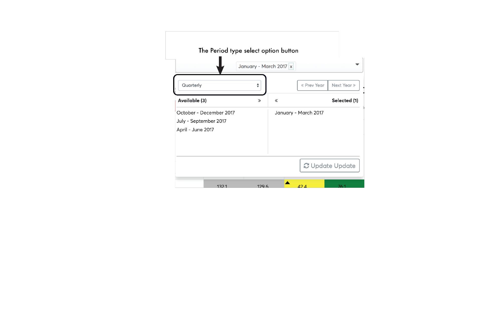

### Fixed period selections

To select fixed periods, start by selecting a period type from the
period type list. You can then select periods from the list of available
periods.

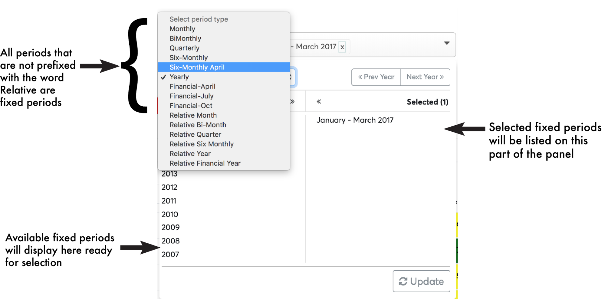

### Relative period selections

To select relative periods start by selecting a period type from the
period type list. You can then select periods from the list of available
periods.

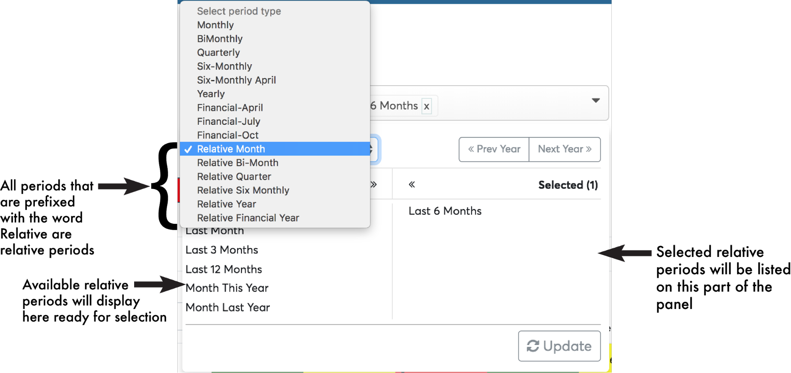

### Extended relative periods

Extended relative periods are relative periods that do not ship out with
the dhis2 by default. These extended relative periods include : Quarters
this year, Quarters last year, Months this year and Months last year.

To select extended relative periods start by selecting a period type
from the period type list. You can then select the extended relative
periods from the list of available periods.

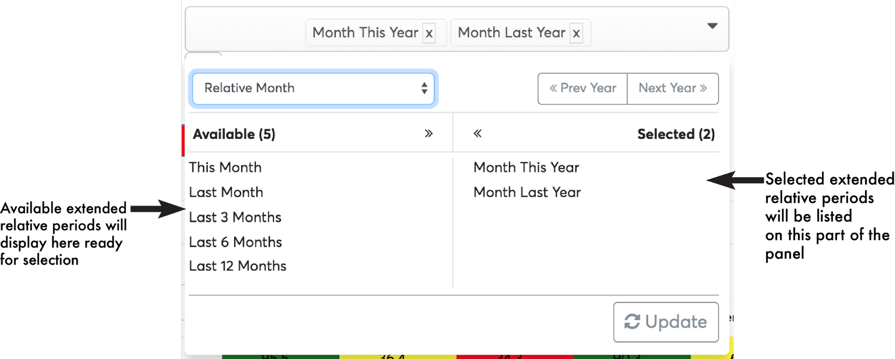

-----

