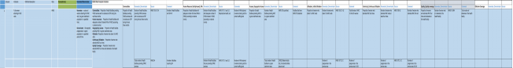

# Annex

## Annex I: Uganda RMNCH Scorecard Indicators and Definitions

Revised after Discussion with the Planning Unit at the Ministry of
Health

|Lifecycle stage|Indicators|Definition/ description|Data source|Assumption(s)|Numerator/ Denominator||
|--- |--- |--- |--- |--- |--- |--- |
|Pregnancy|% of  1st ANC visit within the 1st trimester|This is the percentage of all expected pregnancies in a given catchment population in a given period of time who have attended  their 1st ANC visit within the first trimester|HMIS||Numerator: #of pregnant Women attending 1st ANC visit within 1st trimester  Denominator: All expected pregnancies|Numerator: HMIS  Denominator: HMIS 107: 3.3C  National target = 45%  Color Coding: >45% = green 35%-45% = yellow < 35% = red|

## Annex II: Scorecard and BNA indicators

## Annex III: Scorecard and BNA Training Program

|Time|Agenda|
|------------------ |--------------------------------------- |
|8:45 - 9:00 am|Registration|
|9:00 - 9:30 am|Introduction to DHIS2|
|9:30 - 10:00 am|HMIS 105: Data Elements versus Indicators|
|10:00 - 10:15 am|SHORT BREAK|
|10:15 - 11:00 am|How to use the Dashboards for your Programme - Interactive Session|
|11:00 - 11:30 am|Introduction to Pivot Tables|
|11:30 - 1:00 pm|Pivot Table Interactive Session - Designing Dashboards|
|1:00 - 2:00 pm|LUNCH|
|2:00 - 2:30 pm|Introduction to Data Visualization Tools|
|2:30 - 3:15 pm|Data Visualization Interactive Session - Designing Dashboards|
|3:15 - 3:30 pm|SHORT BREAK|
|3:30 - 4:00 pm|Introduction to Scorecards and BNA|
|4:00 - 4:45 pm|Scorecard Interactive Session - Designing Dashboards|
|4:45 - 5:00 pm|Wrap up and Conclusion|

