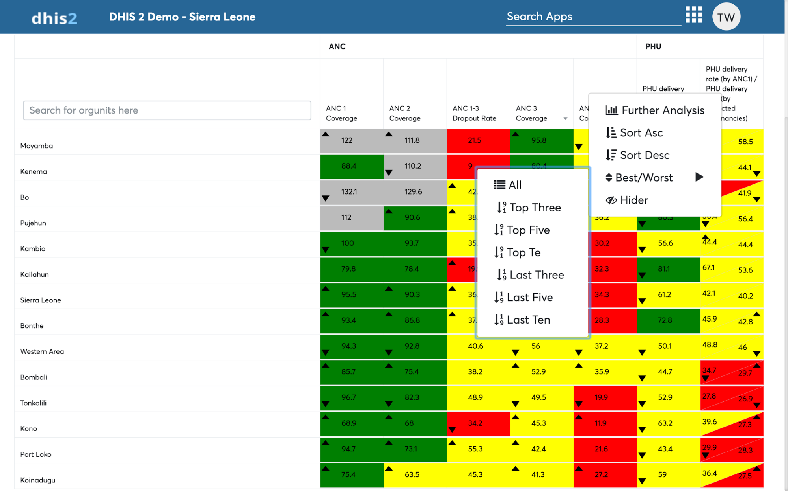
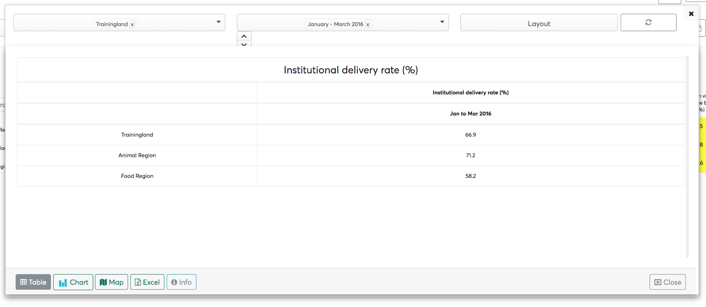
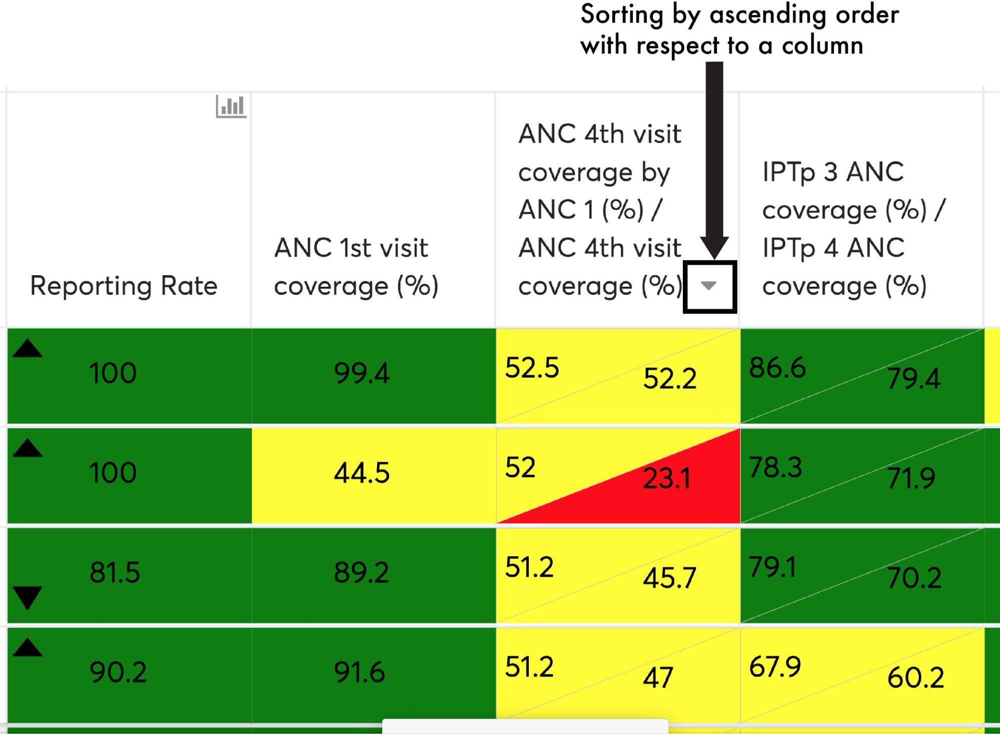
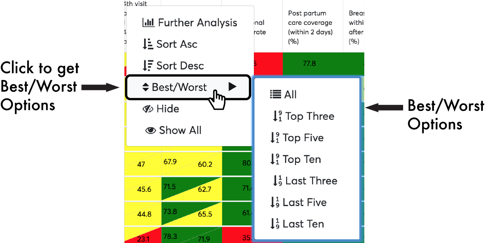
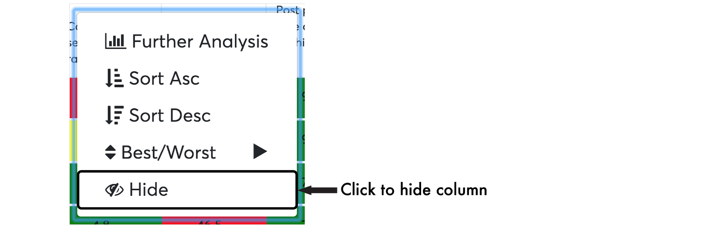
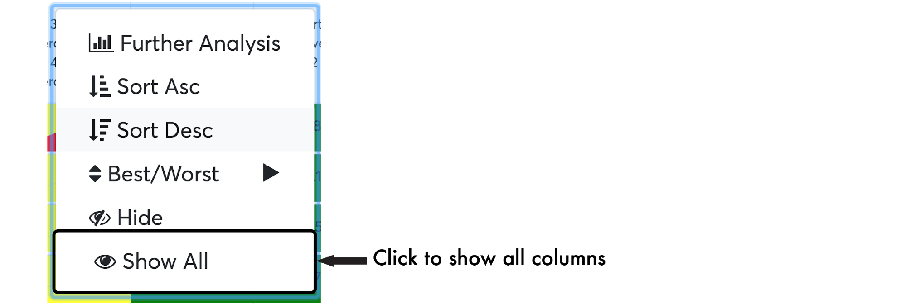
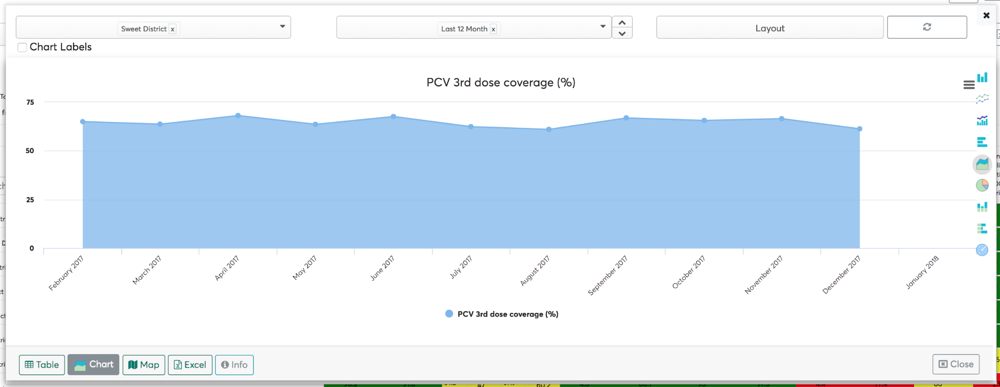

# Context menu

The scorecard app offers two types of context menu for quick access of
additional features and scorecard capabilities. The two context menu
includes:

1.  Column context menu (accessible via headers)
2.  Cell context menu (accessible via cells)

The column context menu can be accessed by right clicking on a column
header, and a cell context menu can be accessed by right clicking on a
particular cell.

## Further analysis by entire column

From the Column context menu, clicking “Further Analysis” opens a modal
with a pivot table visualizing the data of the column.

Navigation within the further analysis modal is explained in Chapter 8.

> **NOTE**
>
> Further analysis by entire column uses entire selections in rows, by
default selection in rows are organization units.

## Sort asc/desc by column

From the Column context menu, clicking “Sort Asc” will sort the data
with respect to the ascending order of the column content and an arrow
pointing downwards shall display next to the column name to signify that
the values decrease going down the column.

Similarly, clicking the “Sort Desc” will sort the data with respect to
the descending order of the column content and an arrow pointing upwards
shall display next to the column name to signify that the values
increase going down the column.

## Best/worst by columns (top 10,5,3)

From the Column context menu, you can view the Best performers by
choosing Top 3,5,10.

Similarly, you can view the Worst Performers by choosing Last 3,5,10.

## Hide/show column

To Hide a column, simply right click on the column head and click Hide.

If there are any hidden columns, to show them right click on the column
head and the context menu will have have a “show all” option.

## Further Analysis by cell

From the cell context menu, clicking “Further Analysis” opens a modal
with a pivot table visualizing the data of the cell.

## Trend analysis by cell

On the cell context menu, you can analysis the trend of the data for the
last 3,6,12 months, last 4 quarters or the last 5 years by clicking
trend analysis and picking a period of interest.

## Related Indicators analysis by cell

From the cell context menu, if an indicator has related indicators then
you will see an option that allows you to perform related
indicators analysis. Further explanation on related indicators analysis
can be found in Chapter 12.

