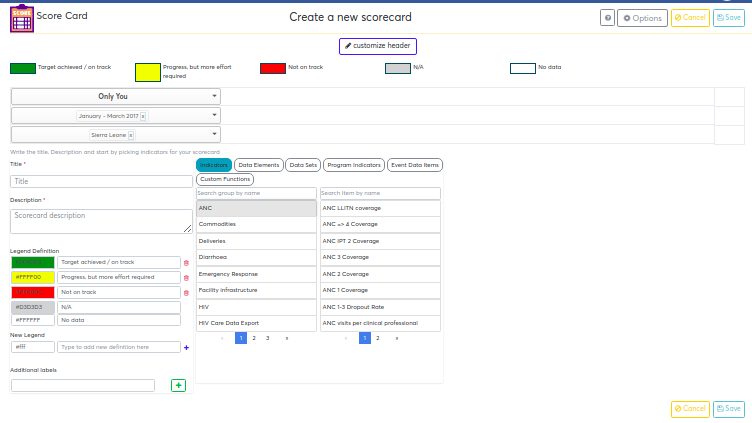
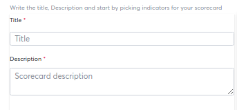
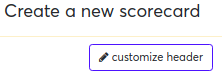
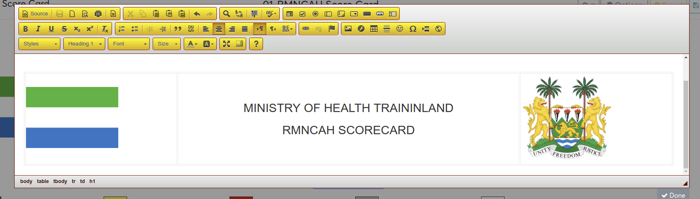
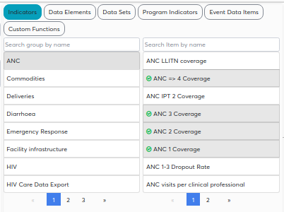
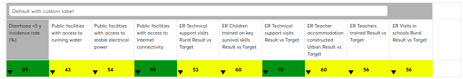
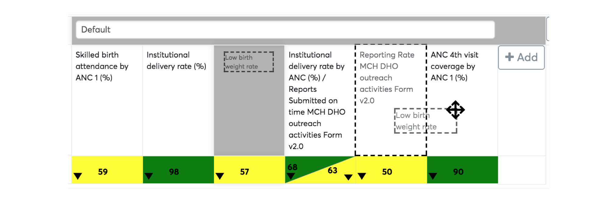

# Creating and managing scorecard

Scorecard can be created via creation interface, which is accessible to
“create” button on the top right corner while on home/listing page.

Click “create”, to open scorecard creation interface. If not on home
page, to access create button from any page, go back to home/listing
page.

Once on the scorecard creation interface, scorecard can be created
quickly in three simple steps

1.  Labeling and branding of scorecard  

2.  Selecting data for the scorecard  

3.  Managing layout and saving  

## Labeling/Branding scorecard

Labeling of scorecard involves and branding involves filling in three
main fields.

  - Name, used for future search  
  - Description, used for detailed/deep search  
  - Custom header, for branding by placing banner on top of scorecard

### Labeling of scorecard

Start by labeling scorecard with name and description, that can be done
by entering title and description of scorecard on the middle left side
of the scorecard. Title and description of scorecard are mandatory
fields to allow proper description of scorecard as well as allowing
search in the future.  

 

Figure 9.1.1-A: Section for labeling of scorecard with name and
description.

> **NOTE**
>
> Scorecard can not be saved without name and description filled in.

 

### Branding of scorecard

Branding of scorecard is optional, by default scorecard uses name as
heading of the scorecard, which will be displayed on top of scorecard,
custom header field is available to allow more advanced customization
and tailoring of scorecard.

Custom header, uses what you see is what you get(WYSIWYG) interface to
allow complex designs of headers supporting formatting of texts,
alignments and insertion of images.

To edit custom header, locate “customize header” button, on the top
center of the scorecard, where header of scorecard will be displayed.

## Choosing your data selections

To choose type of data in your scorecard simply locate the section next
to title and description for selecting type of metadata, choosing group
and picking metadata of interest.

Select all indicators/data elements/reporting rates/program
indicators/event data items/ custom functions of your choices, to insert
them in scorecard columns.

Selection of score-card is simplified, what you see is what you get
interface, with real-time simulation of scorecard layout.

Basic selection operations includes:

  - Select an item to add it, or un-select to remove if from scorecard
    columns  
  - Drag and drop an item from the data selection to scorecard columns
    to add  
  - Click trash/delete icon on “Cell customization” area to remove it
    from scorecard columns  

Scorecard supports all data selections available in analytics
applications, and supports more, such as custom functions. Among the
supported metadata selections includes:

  - Indicator selection, selection of indicators is done by available
    groups  
  - Data element selection, selection of data elements is done by
    available groups  
  - Data Sets selection, selections in data sets includes, Reporting
    rates, Reporting rates on  time, Actual reports submitted, Actual
    reports submitted on time, Expected reports  
  - Program indicator selections, selection of program indicators is
    done by available  programs  
  - Event data items, selection of data items is done by available
    programs  
  - Custom functions, selection of custom functions is done by available
    functions  

### Standard analytics data selections  

Standard analytics data selections are the selections available by
default on all DHIS2 analytics tools, such as pivot table, visualizer
and GIS. These includes indicators, data elements, data set, program
indicators and event data items. All standard data sections, depend on
the data sources, thus possible period selections for given data
selections should always be taken into consideration

> **NOTE**
>
> Selection of data items who’s reporting frequency is smaller than
default period selection of the scorecard will cause the given
indicators to always return empty(e.g. Monthly scorecard will always
return empty on indicators from quarterly data source) 

### Functions selections

Functions selections are extended analytics calculations supporting a
more open-ended logic of computation, such as logical operations,
predictors and other complex analytics use cases.  To create functions
to work with scorecard download, download function maintenance
application from this link:
[https://play.dhis2.org/appstore/app/dXX2Fk6jwCX](https://play.dhis2.org/appstore/app/dXX2Fk6jwCX) 
Functions makes use of pure good old JavaScript(vanilla JavaScript)
logic to do calculations purely on the browser, without the need for
server, this is accomplished by execution of JavaScript codes that
expects period and data selections and return standard DHIS2 analytics
results.  

Functions comprises of three key building blocks

1.  Input/Selection parameters. Function expects standard DHIS2 periods
    and organization units selections.  
2.  Computation logic. This is an open-ended workspace for writing of
    calculation logic to work on given period and organization unit
    selections, computation logic is usually classified into rules
    dimensions, thus allowing one function to support different use
    cases by defining multiple rules that will control the computation
    logic. Possibilities are limitless, among major operations done
    includes

    1.  Fetching data from aggregate and event analytics and modifying
        results with custom logic, and reformat the results back in standard
        analytics format.  
    2.  Fetching data from existing sql Views, performing custom logics and
        formatting results in standard analytics format  
    3.  Fetching data from other DHIS2 API endpoints(such as data-value and
        events api) and other data sources(including external sources),
        performing custom logic and formatting results in standard analytics
        format.  

3.  Output/Returned analytics. This is the end-result output from
    functions, formatted in standard analytics format, to allow
    compatibility with standard DHIS2 analytics applications.

To support open-ended support for any level of complexity, function
maintenance application has been developed, to allow any developer with
basic JavaScript knowledge to quickly develop custom calculations either
not supported natively by DHIS2 or to allow developer to work-around
limitations or miscalculations from standard analytics.

Main requirements for developing functions includes:

  - Basic web programming knowledge with JavaScript (jQuery is an
    advantage)  
  - Understanding of DHIS2 Web API and analytics  
  - A working installation of Functions maintenance application. When a
    function maintenance application is installed for the first time, it
    creates five standard functions  with generic use cases as example
    functions to allow reuse of codes to create other functions.  The
    auto created functions will also be listed in functions selection
    list.

> **NOTE**
>
> The six generic functions that comes standard with functions
maintenance, are auto generated if no function exists in the system.

## Managing layouts and saving  

Once done with scorecard data selection process, a list of all
selections will be appearing as columns on the scorecard layout area.
Scorecard will be in its most basic layout, and is ready to be saved.
Among the layout standards observations includes:  

  - All columns are grouped in single default group. Group label for
    default single group is not displayed for simplicity.  
  - Values, colors and arrows for each column are auto-generated. Values
    are auto generated to provide real-time what you see is what you get
    (WYSIWYG).  
  - Column labels picks default name of the selected metadata, labels
    can be changed, see section “Customization of cells” section of this
    documentation.  

### Changing layout of scorecard

To change scorecard layouts, simply click on column labels(text), to
select column to move, then simply drag and drop that column to a new
position

> **NOTE**
>
> Click area for drag and drop feature is only active with the text inside
the header field, clicking outside the text doesn’t activate the click
area.

