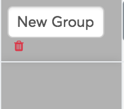

# Customizations and editing of scorecard

You customize scorecard via the create/edit interface. Customization
involves giving scorecard custom headers, grouping cells, setting up the
starting period and organization unit of scorecard, setting access
privilege to users and groups, adding custom labels and legend colors.

## Access sharing settings

The scorecard give user to set sharing who has access to their scorecard
and the privilege (view only/edit) to the particular group of people
that the share with.

Scorecard sharing can be done through the access sharing select option
box, by clicking an image representing a privilege for a group of
interest.

When a privilege has been chosen for a group the color of the icon of
the privilege will change to blue.

> **CAUTION**
>
> Sharing settings from 2.28 going back is only implemented on the
interface, access control is not strictly enforced, it is for simplicity
in management of scorecards only.

> **NOTE**
>
> User groups appearing on the access sharing list should exist in the
user groups that are were created in the “Users” app.

## Startup period and organization unit selection

To set the startup period selection, head over to the period type select
option button and click it, this lists all the period types, from which
you can select the desired period type and then add the period range
from the available list into the selected list.

In order to set the startup organization unit selection, head over to
the organization unit select option button and click it, this lists the
organization units in hierarchical order.

More details on how to select the org units can be found under
Organisation unit selection in the Analysis with the scorecard chapter.

## Grouping of cells in scorecard

Grouping of cells in scorecard can achieved in two steps.

  - Creation of a group

To create a group click the word “Add” will appear on the rightmost
column and a new group will be created.

You can give the group a name by editing the words “New Group”

             

  - Adding data selections into the group

To add data selections into a group, make sure the group has been
selected (has a gray background/fill color) then follow the procedures
to make data selection as explained under Choosing your data selections
in Chapter 9. 

To delete a cell grouping just click the trash icon next to the group
name. 

## Customization of cells

The scorecard app, gives user the ability to customize cells by giving
them the tools that enable them to choose:

  - whether to display the color legends
  - what colors to display on the scorecard and their cut point values
  - the effective gap
  - what labels display on the columns (headings of data selections)

### Column & cell labels

The scorecard app allows the user to customize the column/cell labels.

By default, the column label is the name of the data selection. To
customize the column label, edit the value on the box adjacent to the
words “Label”

### Cell Effective(Minimum) gap

To set the effective gap value of increase/decrease write the number in
the input box adjacent to the words “effective gap” and save changes.

### Cell cut-of points range

To set the effective cell cut-of points range for a data selection
(column), edit the min – max values under the legend information of the
data selection.

> **NOTE**
>
> Minimum of upper class should be equal to the maximum of lower class, no
gap should be left between classes, to leave open ended upper limit for
topmost class and lower limit for lowest class use dash “-”. The
classification of values between intervals behaves as follow:
  - Lowest and middle classes, values limit range from lower limit
    inclusive, to upper limit exclusive(excluding upper limit itself,
    i.e. value equal to upper limit will be accounted in next upper
    class)
  - Highest class, values limit range from both lower and upper limit
    inclusive(i.e. values of both lower and upper limit will be
    accounted in the same class, upper limit won’t be excluded)

The ranges are automatically generated evenly between 1 and 100 range,
divided by total number of classes(default is three).

### Display effective gap arrows

To display effective gap arrows of increase/decrease make sure the
checkbox adjacent to the “Display arrows” label is ticked. To hide
effective gap arrows simply make sure the check box is unticked.

### Show legend colors

To show legend colors make sure the checkbox adjacent to the “Show
Colors” label is ticked. To hide Legend colors simply make sure the
check box is unticked.

## Stack two cells in single column

To pair two cells in one single column, add one of the data items of
interest scorecard in, click it and make sure it is grayed (to indicate
that it is the active data selection), then on data selection area
navigate to the second data item of interest and right click on it and
select pair with current.

> **NOTE**
>
> Pairing of indicator is useful when presenting two indicators measuring
same goal(e.g. ANC 4th visit coverage by 1st visit and ANC 4th visit by
total population of women of childbearing age), or placing many
indicators in single page(e.g. A4 paper comfortably fits around 15
columns on portrait, thus with stacking can fit up-to 30 indicators)

## Color codes for cut-off points

The scorecard application allows you to customize the color code for
cut-off points by changing the existing color codes or by creating new
color codes and defining their range.

To change an existing color code, navigate to the legend definition
section, click on the color of interest and pick another color from
color picker.

To add a new color code definition, navigate to the the “New legend”
section. To define color of legend  click button on the left and pick
color  from the color picker.

> **WARNING**
>
> Adding new color definition resets all defined value ranges for all
indicators back to default range(i.e. ranging from 1 - 100 divided
evenly by new number of classes). Always revisit all indicators after
adding/removing classes to update new class ranges based on new classes.

## Additional labels

The scorecard app allows the user to add additional labels that will
appear under the organization unit. Such labels can be used for variety
of purposes, common usage includes

  - Source of indicator

