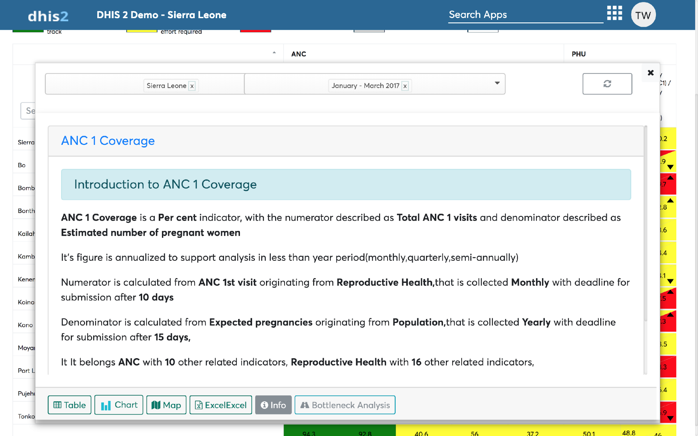
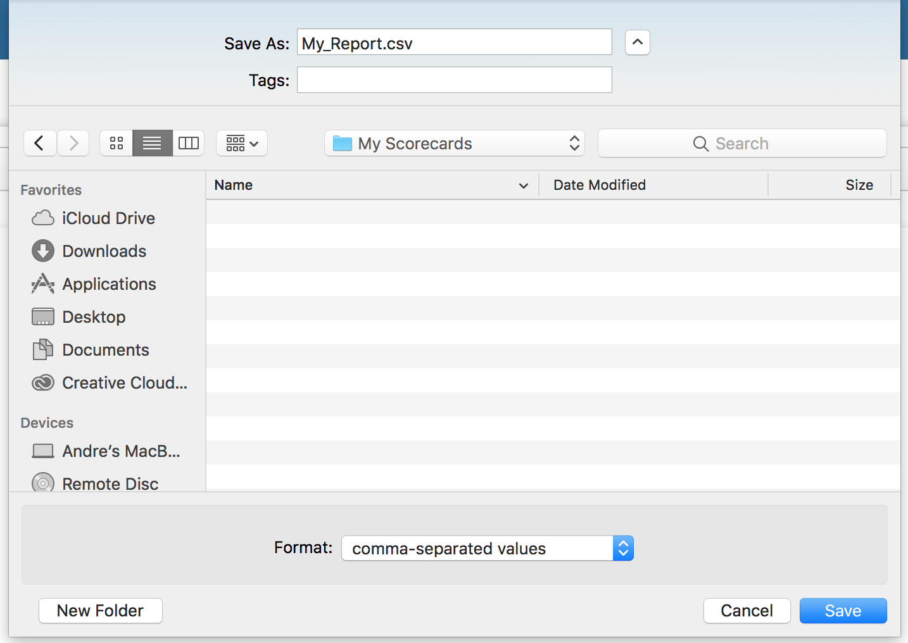

# Further analysis

As hinted earlier the further analysis menu can be access via the
context menu. This chapter explains deeply on the operation that can be
performed in the further analysis module. 

## Related indicators analysis

On the Interactive Scorecard if a data selection support related
indicators analysis and option to perform related indicator analysis
will be visible when performing further analysis. Clicking the Related
indicator analysis button will display a chart of the indicators related
to the data selections.

To show chart labels click on the chart labels checkbox which appears
below the period selection box.

Related indicators analysis charts can be downloaded. For more
information about downloading and printing charts on the scorecard app
refer to chapter 8.6.3.

> **CAUTION**
>
> Related indicators currently only support single period selection, as
with multiple period selection, indicator relation lose its meaning for
its use cases.

## Pivot table analysis

Pivot table further analysis, visualizes the data in tabular manner. You
can switch between organization unit and periods but also you can change
the table layout.

## Chart analysis

Chart further analysis, visualizes the data in graphical manner. You can
switch between organization units and periods but also you can change
the chart layout and switch between various chart types (i.e. bar chart,
stacked bar chart, line chart etc.).

## Map analysis

Map further analysis, visualizes the data on map. You can switch between
organization unit and periods but also you can switch between various
base maps  that your data would be drawn on base layer. Currently
supported base layers includes Map surfer, OSM Dark, Topography Maps,
Earth Imagery,OSM Black and White, OSM Hot and Stamen Toner.

## Data dictionary

When performing further analysis, you can open the data dictionary for
the data selection item of the column/cell by clicking the info button.

## Operations on Further analysis

You can perform more operations within the further analysis module, such
as downloading scorecard, printing it or switching of layout.

### Layout selection

On further analysis you can change layout for pivot table by drag-n-drop
across filters, row dimensions, and column dimensions.

Similarly, you can change layout for chart by drag-n-drop across
filters, category (y-axis content), and series (the x-axis content)
dimensions.

### Downloading data of the pivot table further analysis

You can download the column or cell data observed during further
analysis by pivot table into excel format by clicking, the “Excel”
button located on the bottom of the further analysis button. This shall
download the data in csv format and you can perform any desired
operations on an excel file handling application offline.

### Downloading and printing of chart on further analysis

To print or download the further analysis chart, clicking on the chart
context menu this will give options for downloading the further analysis
chart.

To download just pick a file format of interest and click on it to
initiate download.

To print simply click the word “Print”.

> **NOTE**
>
> To hide headers and footer containing page url or page name, and get
colored PDF document.
>
>  - On Chrome browsers, Expand “More settings” and untick headers and
>    footer,  choose destination printer to “Save as PDF” to download
>    colored PDF document.
>  - On Firefox, open “Options” tab and set header and footer to
>    “--blank--”, choose destination printer to “Print to file” to
>    download colored PDF document.

