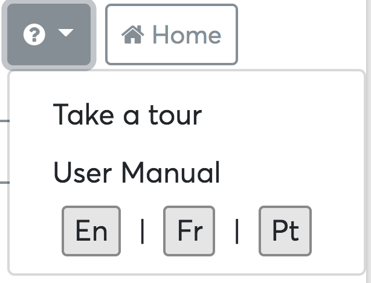
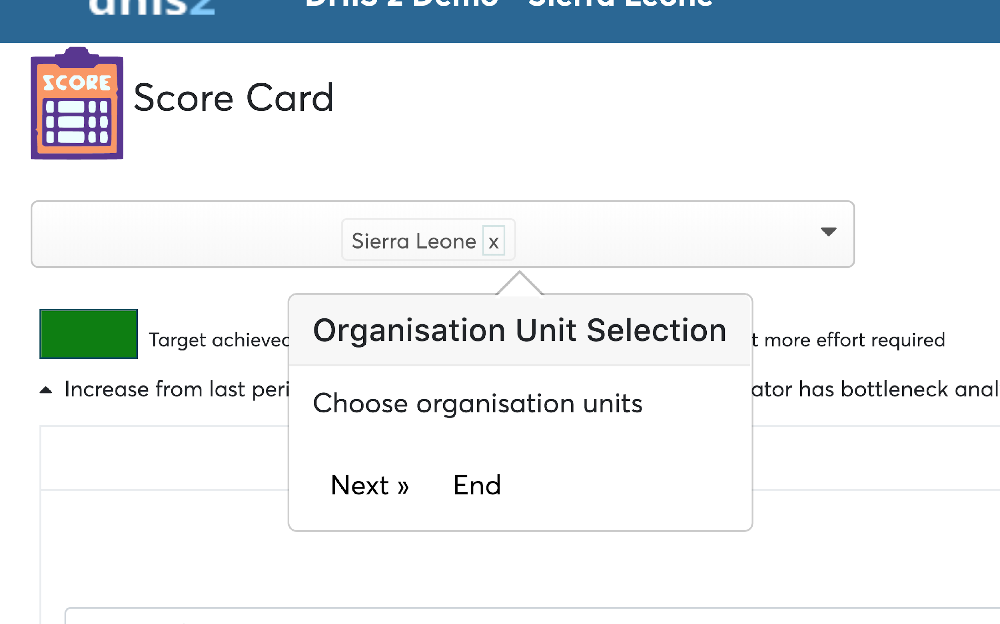

# Help, tour guide & translation

The scorecard offers a quick guidance to get the user started off with
using making use of the basic features of the app, user documentation
can be accessed from within the app as will be explained in this
chapter.

## Tour guide

To get a brief tour of navigation across the scorecard app simply click
the Help icon and choose “Take a tour” and a floating pop-up will appear
hinting on some basic navigation that user can use to analyze with
scorecard.

## Help and documentation

The documentation of the scorecard app is accessible through clicking
the “User Manual” from the Help dropdown menu. This will open the
documentation of the scorecard app.

## Translations

The scorecard app offers basic translation for up to three languages,
French, Portuguese and English.

By default, the app opens up with English Language.

To change Language to French, click Fr.

To change Language to Portuguese, click Pt.

