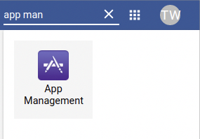
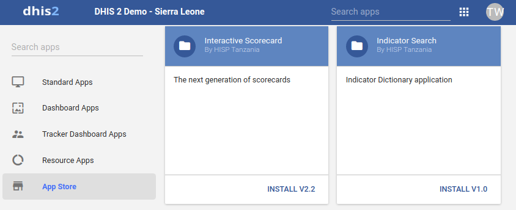
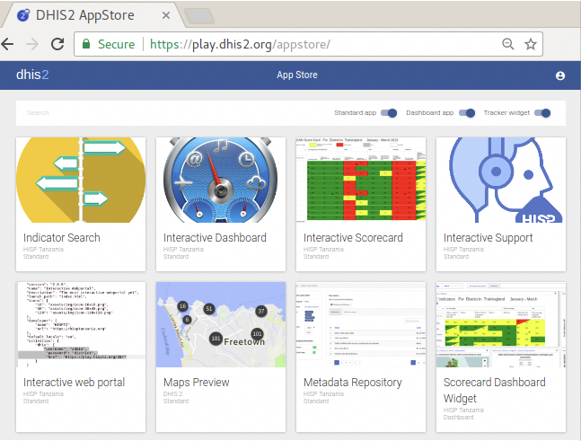
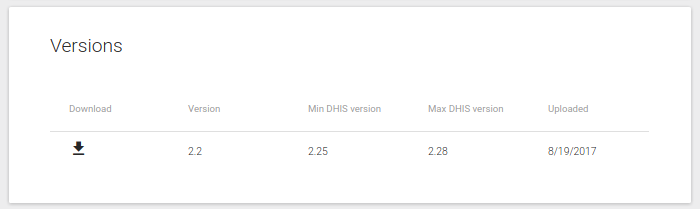
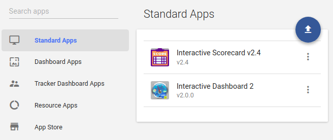

# Installing scorecard

Scorecard application is completely free and open source, and it is
available on DHIS2 app store (https://play.dhis2.org/appstore), download
the latest scorecard application with long term support.

To install any application into DHIS2, requires superuser privilege,
make sure your account has necessary authorities to install the
application, or contact DHIS2 support team for acquisition of account
with privileges for installation of apps.

> **NOTE**
>
> Interactive scorecard supports all versions of DHIS2 from 2.25 going
upward, It can run in lower versions with limited functionalities and with no
support for fixing any issues.

There are two ways of installing interactive scorecard into your
DHIS2 instance.

## Installation from within DHIS2

This installation approach is the most direct, but only available on
DHIS2 running version 2.28 and above.

Step 1:

Simply open Apps management by clicking on Apps search menu or apps icon
on the top bar to locate Apps Management, click to bring down list of
apps, or search “Apps Management”. Open the Apps management to go to
apps listing See figure below:

Step 2:

Once Apps management is open, go to Apps store panel, accessible on the
left navigation menu, a list of online applications for installation
will show up, look for interactive scorecard.

Once found, click install to install the application. When done
installing, the interactive scorecard will be accessible from the search
menu.

> **NOTE**
>
> This step is only successful is you have an internet connection and your
DHIS2 instance is accessible online.

## Installation from DHIS2 App store website

This approach of installing DHIS2 requires visiting DHIS2 App store
website, downloading a zip file of the latest stable build of scorecard
app, and manually installing it into DHIS2.

This approach is recommended for all DHIS2 instances running on version
2.27 and below.

> **NOTE**
>
> Ensure that you have good and stable internet connection to download the
zip file.

 

Step 1: Downloading the compatible version from app store

Once on DHIS2 App store, locate interactive scorecard application, and
click it to get the list of available versions of the scorecard. Pick
the most latest version of the scorecard and download a zip file of the
latest build into your local hard disk.

> **NOTE**
>
> The zip file name may have cryptic alphanumeric name such as
“3ad63731-a75d-4adb-95a1-4f646e481c20”. You may rename the zip file to
easily locate it in the future, with naming such as “scorecard-v2.x.zip”, where “x” is version number of your build.

Step 2: Uploading the app into Dhis2

Click on Apps search menu or apps icon on the top bar to locate Apps
Management, click to bring down list of apps, or search “Apps
Management”.

Open Apps management to see and manage list of installed applications on
DHIS2, Interactive scorecard app can be installed by clicking the upload
icon.

Once installed, interactive scorecard application will be enlisted under
standard apps

When done installing, interactive scorecard will be accessible from the
search menu.  If scorecard doesn’t appear on your menu, it may be not
visible for one of the two issues.

## Installation Access credentials/Permissions.

While scorecard application may be installed in your DHIS2 instances,
you may not have necessary permissions to view  it. In such cases
communicate with DHIS2 moderator or DHIS2 support team for the
application to be assigned to one of your user roles.

## Installation not successful.

Scorecard application will not be visible in your application, if it’s
either not yet installed in your DHIS2 instance or installation process
failed for technical reasons.

Most common failure to install, results from misconfiguration of
read/write permissions of the installation folder on the server hosting
dhis2. Misconfiguration of permission can also result from  denial of
ability to delete an installed application.

To resolve this, back-end access of DHIS2 is required, to assign proper
ownership and read-write permission of the folder for holding installed
apps.

> **NOTE**
>
> Location of folder for installed apps varies depending on the version of
DHIS2 Installation.

1.  From version 2.27 going down, the folder for installed apps is
    located in \[DHIS2\_HOME\]/apps
2.  From version 2.28 and above, the folder for installed apps is
    located in \[DHIS2\_HOME\]/files/apps

For more information on how to create and install applications on DHIS2
please visit https://www.dhis2.org/how-to-create-find-install-apps

