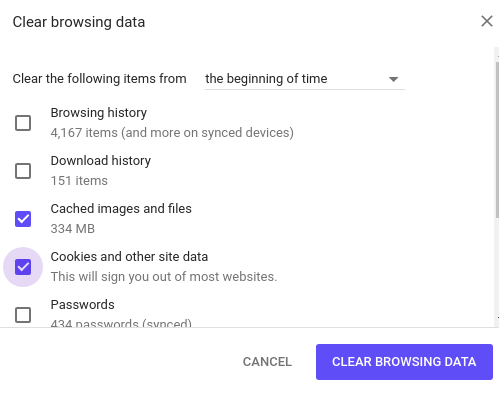

# Opening and browsing scorecards

Scorecard application can be found in  the Apps menu, if scorecard
application is not yet installed in your DHIS2 instance or installation
has issues, refer to the installation instruction (Chapter 2) of this
documentation for further guidance.

## Opening of scorecard application

Open scorecard by locating it in Apps search menu or apps icon on the
top bar, click to bring down list of apps, or search “scorecard”.

Once open, scorecard application will bring list of created scorecards,
or when no scorecard exists, a step by step instruction on how to create
scorecard.

> **NOTE**
>
> If scorecard application is taking too long to load, and you’re not on a
slow network, make sure you have cleared your browser cache.

Scorecard makes good use of cached files for better offline experience,
as a result, when installing higher version, scorecard may use older
version of cached files and thus break down while loading.

 

Figure 3.1-B: Scorecard application in a continuous state of loading.

## Clearing application cache

Approaches to clear application cache and browser interface, vary from
browser to browser, but the common standard keyboard shortcut for all
browsers is “CTRL+SHIFT+DELETE”.

Accessing interface for clearing browser cache can be done via the
following approaches:

  - Google chrome: Go to the menu icon on the top right corner, and
    click it to open, go to more tools menu, and choose “Clear browsing
    data”. Once interface is open, Make sure  “Clear the following items
    from” is set to “The beginning of time”.  
  - Mozilla Firefox: Go to the menu icon on the top right corner, and
    click it to open, go to  Library, and go to History, and choose
    “Clear recent history”. Once interface is open, Make sure “Time
    range to clear” is set to “Everything”, and “Details” option is
    expanded to show all details options.  Once on the clear browsing
    data or recent history, tick “Cache”, “Cookies”, “Hosted app data”
    or “Offline Website data”. To clear all cached files, cookies and
    locally stored data by scorecard.

 

> **NOTE**
>
> These will also clear all cache information and cookies from other
websites you’ve visited in your browser.

## Browsing the  scorecard application

Once a scorecard application is open, it will display a list of all
scorecards the user has permission to access. Items are by default
displayed with list view, showing three items at a time, with pagination
to access more scorecards. All scorecards are sorted by names in
ascending order.

To locate scorecard, use the search panel to search by name or
description of the scorecard, search will locate all favorites user have
access to and list them sorted in ascending order.

## Display/Listing of scorecards

There are three standard types of scorecard listings to allow navigation
and traversing through long list of scorecards

### List view

This is the default listing scorecard, displaying three items per page,
while providing pagination options to move between pages.

### Card view

This displays all scorecards without paginations in multiple rows with
two columns throughout, allowing vertical navigation of scorecards.

### Thumbnail view

This displays all scorecards without pagination in multiple rows with
one column throughout, allowing more detailed view of each single
scorecard.

To visualize data with scorecard, click a particular scorecard of
interest. For more information on all functionalities available for
navigating scorecard, visit the “Analysis with scorecard” section of the
documentation.

