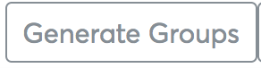

# Related Indicators Analysis in DHIS2

This chapter focuses on utilization of scorecard indicators to perform
related indicators analysis, related indicators analysis can be used for
a wide range of use cases, among them being causality analysis( also
referred to as the bottleneck analysis).

While this documentation will delve into the use case of related
indicators for bottleneck analysis, this chapter shall introduce you to
the basics of bottleneck analysis and how to use the related indicators
feature for any suitable/relevant use case.

Bottleneck analysis is a systematic way to look at the main determinants
of effective coverage for selected interventions to identify problem
areas and purposely act on them

There are six coverage determinants, from supply to demand side that
analyze where health system bottlenecks exist. A bottleneck is a loss of
system efficiency

The combination of bottlenecks identified  determines the quality, and
hence the effectiveness, of coverage in any given setting.

## Measuring Determinants

Among the modifications made on the efforts to adapt the Tanahashi
approach for use in Marginal Budgeting for Bottlenecks tool in the 21st
Century include focusing determinants of effective coverage.

Each determinant was analogous to a Tanahashi stage that leads towards
the goal of effective coverage. In addition, ‘availability’ was divided
into two determinants: availability of commodities and

availability of human resources

Ultimately the combination of bottlenecks identified  determines the
quality, and hence the effectiveness, of coverage in any given setting.

This modified model was easier for practitioners to use since it
reflected the types of data that were available and permitted the
identification of bottlenecks through a step-wise approach that
evaluates six determinants of the effectiveness of coverage of an
intervention:

1. Availability of essential health commodities

2. Availability of human resources

3. Accessibility of distribution points for the interventions

4. Initial utilization of interventions

5. Continuity/completeness in the continuous utilization of interventions

6. Quality of interventions delivered.

The first three determinants focus mainly on supply side constraints,
while the final three focus largely on demand side barriers.

While there are many national policies and guidelines for effective
interventions to reduce maternal and child mortality, these
interventions do not always reach those who need them most due to
bottlenecks within and outside the health system.

The scorecard app allows for the user to add related indicators to an
indicator so that they may inspect the impact of the relating indicators
by further analysis. The next subchapter explains how the use can do
this.

## Related indicators

In scorecard related indicators are associated with scorecard
indicators, and can be added to scorecard indicators on the indicator
cell customization area. Related indicators are used sometimes as
minimal drop in support for bottleneck analysis.

The relations between indicators in scorecard and indicators for
analysis are initiated in the edit interface.

> **NOTE**
>
> Related indicators like scorecard indicators, can be any existing
metadata in DHIS2, from data elements, indicators, reporting rates,
program indicators, event data items as well as functions. If required
metadata is missing it has to be created

To add related indicators to a data selection, click the data selection
and navigate to the column customization section and click on the
Related indicators button

Related indicators in chart visualization, can be implemented in two
simple visualizations, this includes

1.  Multiple indicators per determinant, using determinant as a group,
    with indicators names for each bar and determinant name as group in
    the chart x-axis.
2.  Individual indicator per determinant, where one determinant have one
    indicator

### Individual indicator selections

For individual indicator selection in related indicators for scorecard,
If the related indicators belong to a group of the same context, then
they can be added as individual indicators.

In related indicators analysis, where each determinant have single
indicator for measurement, individual indicator selection is the best
choice for data analysis.

Among use cases of individual indicator selection includes causality
analysis across six measurement determinants to assess potential
fluctuation of trends across determinants (notice each determinant have
one indicator used).

To add individual related indicator selections, click “Use Individual
Items” and make your data selections.

When a selection is made a card will appear to right with the name of
the Indicator, the display name, baseline and target. Also a real-time
related indicators chart shall be displayed on the bottom.

Display Name, Baseline and target can be edited.

### Grouped indicator selections

For  grouped indicator selection, If the related indicators belong to
different groups, then they should be added as group indicators.

In related indicator analysis, where one determinant can have multiple
indicators, grouped indicator selection is the best choice for analysis,
where determinants can be created as groups and indicators can be
inserted to given determinants.

#### Managing groups

To add group related indicator selections, click “Use Groups”. There are
to ways of creating grouped indicators :

  - Generating groups
  - Manually creating group

For grouped indicator analysis following standard built-in determinants,
determinant groups can be auto-generated by clicking “Generate Groups”
button which will generate determinant groups ready for inserting
indicator per each determinant.

To create a group manually, click the “Add Group” button

To make data selections to the groups, first click the group click on
the group name the click the data selection of interest on the data
selections section.

You can sort/rearrange indicators within a group by dragging them from
their current position to a destination position.

To delete data selections click the trash icon on the Group Title then
click the tick icon.

> **CAUTION**
>
> The deleting process is irreversible and deleting a group will delete
all the data selections that have been made to the group of the group as
well.

#### Managing labels of grouped indicators

When a selection is made a card will appear to right within its group
with the name of the Indicator, the display name, baseline and target.
Display Name, Baseline and target can be edited.

#### Color coding indicator by their groups

The related indicator groups are color coded so as the user can easily
distinguish between indicators of different groups. The color codes can
also be changed by simply clicking the color bar above the group name
input box, and selecting a color of interest.

#### Real-Time Related Indicators Chart

When a selection is made a real-time sample related indicators chart
shall be displayed on the bottom of the section.

## Action tracker on Bottleneck analysis

### Introduction

The Action Tracker is a mechanism through which decision makers and
actors track progress in implementing priority interventions designed to
address root causes of bottlenecks in RMNCH performance at different
levels of the health system from national, regional, district and
sub-district level. The action tracker represents an important tool for
documenting and assessing progress towards implementation of locally
owned and led solutions to RMNCH performance issue.

The action tracker is part of coverage, and bottleneck analysis that
utilizes DHIS2’s analytical features to track and assess national and
sub-national level performance for purposes of improving health service
delivery.

### How to track action in DHIS2

Performance on interventions is reviewed through Quarterly District
Review Meetings (QDRM), mid-term or annual programme reviews to assess
progress, identify bottlenecks, their causes and suggest possible
solutions/actions to address gaps at district, health sub-district and
facility levels.

To ensure effective and efficient service delivery, these
actions/solutions are monitored/tracked on a routine basis, and
designated persons within the District Health Management Team (DHMT)
provide updates/progress on prospective actions.  Routine monitoring of
actions/solutions to bottlenecks on various interventions is done in
consultation with other District Health Teams (DHT) and other national
and development stakeholders. Once actions are agreed upon,
documentation and reporting follows which can be done either using the
DHIS2 system or district activity monitoring log books.

### How to setup event capture for action tracking

The current setup in the DHIS2 is based on a demo concept planned to be
progressively improved to create linkages with scorecards and related
indicators analysis features. The tool is currently implemented as a
single event without registration using DHIS2 event capture tools. The
demo App is setup on the scorecard-dev instance at
https://scorecard-dev.dhis2.org with the username and password provided
on the login page

### How to use event capture for data entry of action tracker

#### Browsing event capture

To browse the action tracker demo app, access the scorecard-dev instance
with your login, at the main menu page, search for “Event capture”

Using the event capture app;

1.  Use the organizational unit tree to drill down to district level
2.  You will notice that selection in the registering window changes to
    the selected organization unit
3.  If there are more than one program, use the drop down window to
    select the preferred program

    

4.  Click on the register button to begin
5.  Select the “Report date” window to begin entering data

#### Data entry with Action tracker

Data entry in the action tracker is based on identified bottlenecks in
health service delivery at sub-national level, their root causes and
planned actions. The bottlenecks are classified using Tanahashi’s six
determinants of coverage. To begin data entry;

1.  Select the category of the issue identified and the root causes
2.  State if any reviews have been done regarding the issue, progress
    and the responsible persons to follow-up
3.  Click on the “Save and Add New” buttons to save the issue for
    follow-up

    

4.  Click on the “Cancel” button to return to the list of bottlenecks
    and actions.  

#### Data Review and editing

Using the Event capture app, data on the bottlenecks, root causes and
actions can be reviewed, printed and edited. This is important
especially during follow-up on progress of actions as stated and
discussed in previous sub-national level review meetings.

To edit a record,

1.  Click on the record to access the record edit menu

    

2.  The data will open in an edit window, edit the record by stating the
    actions taken to avert bottleneck, also state the progress

    

3.  Click on the “Update” button to save the changes

    

