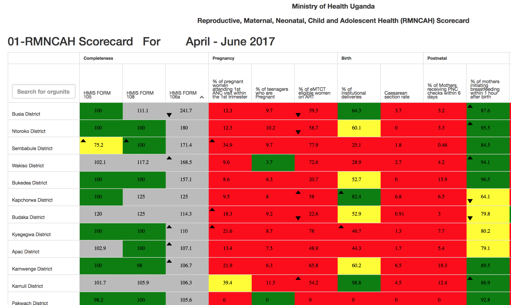
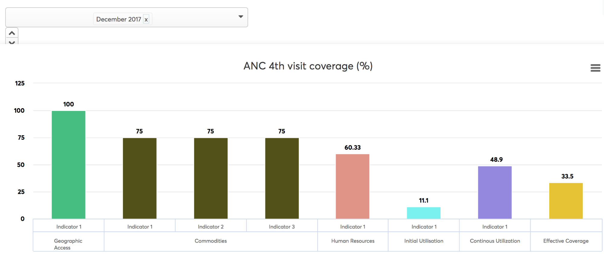

# Scorecard and bottleneck analysis implementation

This chapter provides high level guidance for implementation of
scorecard and Bottleneck Analysis (BNA) who audience include District
Health Management Teams (DHMT), Ministry of Health (MoH), Implementing
and Development Partners in health.  This text aims to guide any country
or organization using DHIS2 for their aggregate reporting at multiple
levels of the system and also implementing individual records using
event capture, action tracker and Dhis2 tracker capture App. This guide
takes into consideration that DHIS2 has been customized to support
reporting requirements and the need to further analyze data using a
scorecard and Bottleneck analysis tools, as well as provide
opportunities for enhanced use of data to improve programs supported by
the scorecard and BNA tools/frameworks.  

## Overview

Effective and timely use of HMIS data by managers at all levels of
health system is critical to inform and improve health service delivery.
 HMIS dashboards have the potential to enhance the use of data for
decision making and planning, by displaying information for managers in
an accessible and actionable manner. Managers who have competing demands
and limited time, resources and training to conduct data analysis, are
often left to organize HMIS data themselves, making HMIS a less
user-friendly and effective tool than it might be otherwise.  

Building data visualization features that reflect a systematic theory of
change / workflow within the DHIS2 software allows end users to
effectively use data for action. Scorecards and Bottleneck analysis
dashboards in DHIS2 help users to produce meaningful visualizations to
identify low performing districts, monitor high impact interventions
that are lagging behind and pinpoint  bottlenecks to effective health
service delivery including identification of  root causes and solutions,
with the aim of guiding operational planning, tracking progress and
performance over time and strengthening accountability for better
results.  

The scorecard was initially introduced by ALMA (Africa Leaders Malaria
Alliance) as a monitoring and accountability tool to boost malaria
control efforts and track progress against malaria indicators. A number
of countries adopted the tool at country level to implement the RMNCAH
(Reproductive, Maternal, Newborn, Child and Adolescent Health) scorecard
to enhance accountability and transparency. However inadequate linkages
with the HIS (timely data availability) caused delays on effective
program monitoring.  

The innovation here is the integration of the scorecard functionalities
within DHIS2 through a specialized dashboard that not only helps to
track progress but also provides tools to perform in-depth analysis, to
identify causes of lack of performance in order to drive actions.

## Planning implementation of scorecard and bottleneck analysis

### Defining strategy

The scorecard is an effective tool to enhance accountability and track
progress and actions towards health and nutrition outcomes. The
scorecard uses tracer indicators for reproductive, maternal, newborn,
child and adolescent health interventions to monitor progress national
and global targets. It displays data on table using different color
coding (green to red) and arrows to show the direction of progress over
the monitoring period (quarter, semester or annual). The scorecard
alerts program managers and decision makers to be aware of areas which
continuously record low performance and lack of progress as well as
those needing more attention and actions.  

The bottleneck analysis consists of a structured analysis of the
determinants of coverage for key reproductive, maternal, newborn, child
and adolescent health interventions. It’s based on Tanahashi’s Health
Service Coverage Evaluation methodology \[Tanahashi, T. “Health Service
Coverage and its Evaluation.” Bulletin of the World Health Organization.
56: (2): 295-305. 1978\], which examines supply, demand and quality
determinants that contribute to effective intervention coverage. The
analysis looks at six determinants of coverage across the supply, demand
and quality determinant categories which include:

1.  Availability of Essential Commodities
2.  Availability of Trained Human Resources
3.  Geographic Access
4.  Initial Utilization
5.  Continuous Utilization
6.  Effective Coverage

It aims at understanding root causes of weak effective coverage by
analyzing supply and demand side indicators to identify obstacles or
bottlenecks hindering high effective coverage. Specific strategies and
actions could be taken to address the causes in order to mitigate or
remove bottlenecks. Below and illustration graphic showing bottleneck
analysis using the interactive scorecard.

### Identify stakeholders and motivations

It’s good to take a look at the main motivations of the stakeholders and
how to mitigate risks resulting from potential diverging interests.

  - Central MoH Departments such as M\&E & Planning often are the main
    stakeholders for standardisation and specification of indicators and
    IT Systems
  - Central IT departments have a general interest over (often locally
    controlled) technology choices and ownership, hardware and software
    purchases. They are often dealing with network and hardware issues
    but lack experience dealing with complex web-based architectures and
    data exchanges.
  - Specialized disease programs are often under pressure to deliver
    very program specific indicators, both for their own management but
    also responding to donor driven approaches. They may also feel more
    comfortable controlling their proper IT system to be sure their
    needs are prioritized.
  - Specialized functional areas (such as Human Resources, Logistics,
    Hospital Management) are often in a sandwich position, having to
    cater to the information needs of several different stakeholders,
    while trying to achieve operational efficiency with limited
    resources.

By identifying who is interested to provide or utilize the data, the
lead implementers can start to form a project team to inform the design
and implementation. One method for characterizing stakeholders involves
grouping interested parties by their functional roles.

### Opportunities and challenges

Key to the successful implementation of the scorecards and Bottleneck
analysis is a buy-in from national and subnational level stakeholders
including ALMA that has been very instrumental in the support and
implementation of the RMNCAH scorecard. At the Ministry of health,
consensus needs to be reached on who will monitor and follow-up the
implementation. At the district level, the DHT (District Health Team)
and other facility and community level staff need to be included in the
implementation process.  

Scorecard and Bottleneck analysis implementation need to make use of
existing national infrastructure and performance management systems.
Countries where DHIS2 is being used for reporting national health
indicators find this process a bit easier for implementing scorecards
because most of the indicators required for scorecards are already
captured /collected and aggregated in the HMIS.  

Existing challenges,  for example data availability in existing DHIS2
system, follow-up on routine district review meetings to address
bottlenecks and corresponding actions, may hamper analysis and use of
the scorecards and Bottleneck analysis tools. These challenges would
have to be addressed in an inclusive rather than exclusive process.
Other challenges including availability of infrastructure and support at
district  level need to be addressed by putting in place mechanisms that
ensure sustainability of the process.

### Organization and stakeholder considerations

Engaging stakeholders as part of the implementation process creates a
dynamic team that ensures the support for the scorecards and bottleneck
analysis. Identifying  teams to support the different components of
implementations both technical and policy is key to this process.

## Identify user and system specifications

Identify the different thematic areas for the different scorecards, this
should be guided by the different health programs in a country or
project. Reproductive Health , Maternal, Neonatal and Child Health,
etc.. could have different indicators and scorecards. Additionally
specifying the frequency of reporting, the lowest level of data analysis
should also be specified. This may also be determined by the DHIS2
reporting frequencies implemented by the existing national or parallel
system.

### Defining interventions

Identification and inclusion of interventions into a scorecard should be
aligned with national priorities, as reflected in national plans and
strategies.  In practice RMNCAH indicators cover the full continuum
care.

Country experiences have shown that effective selection of indicators is
guided by an inclusive process involving all stakeholders in addition to
the ability of the HMIS to capture the most relevant indicators for
program monitoring.

Experience has shown that an average of 20 tracers indicators is a best
balance to keep the scorecard manageable.

It’s important to set up a core working team to oversee the whole
process and decide on indicators. This core team should encompass all
those directly concerned on program implementation and monitoring.

### Identify Data sets and data elements

The core team will ensure that the national database contains required
data elements for program monitoring. It should be part of their role to
decide on the revision of HMIS data collection tools in order to reflect
program management needs.

### Indicator selection and definitions

  - Constitute a technical team to define indicators for key
    interventions for the scorecard (definitions, numerators and
    denominators including source - data elements) including potential
    indicator categories such as Maternal and Newborn Health, Child
    Health, Nutrition, health Systems, etc.
  - For each intervention to include on the scorecard, identify and
    define related  determinants of coverage indicators for supply,
    demand and quality using the determinants framework (refer to annex
    1). These indicators will constitute the cornerstone of the
    Bottleneck analysis.
  - Document and map selected indicators with data elements/program
    indicators (See annex I)
  - Customize both scorecard and Bottleneck analysis indicators in
    DHIS2; defining indicators types, numerators and denominators.

> **NOTE**
>
> Most of the Bottleneck analysis indicators
may not be reported in DHIS2 such as commodities and human resources so
integration and interoperability between systems may be required, refer
chapter 12.4 for more details on interoperability considerations.

### Document user stories

Collecting user stories from the national and subnational level plays a
key role in documenting and deciding workflow processes for scorecards
and BNA.

This process may include the DHT and other facility and community level
staff directly responsible for implementing and monitoring health
interventions.

Documenting the process of data collection, aggregation and analysis,
will help to streamline implementation of scorecards and BNA.

## Consideration for integration and interoperability

In many countries a national HMIS is often the first system to be rolled
out to a large number of facilities and to manage a large number of data
on a monthly or quarterly basis. When countries start to develop their
health system architecture further, DHIS2 often will be connected to
some other systems. This connection is done directly through a simple
script, which automates a data transfer.  

We talk of a 1:1 connection because it is limited to two systems. In the
case of an LMIS/HMIS integration, one LMIS (e.g. openLMIS as is the case
in Tanzania) will transfer data to DHIS2 as defined in the script. In
case a second logistics system would want to transfer data to DHIS2
(e.g. commodity data for a specific disease program), a second script
would have to written, to perform this task. These two scripts would
then run independently from another, resulting in two separate 1:1
connections.  

This hands-on approach often represents a first step and is one of the
most common use cases on the way to an interoperable openHIE
architecture.  

DHIS2 can assume different roles in interoperability scenarios. A common
interoperability scenarios is for DHIS2 to receive aggregate data from
an operational system, in which case the operational system adds up the
transactions before passing it on to DHIS2. However, DHIS2 may to a
certain extent also be configured to store detailed transactional data,
receiving it from external systems or through direct data entry in
DHIS2.  

On this basis we try making a comparative overview, comparing aggregate
DHIS2 data management with data management of external specialized
system. This can serve as a rough orientation, but is not static since
both the capabilities of DHIS2 and its interpretation by implementers
are broadening with almost each release.

|Area|Aggregate DHIS2|External specialized systems|
|--- |--- |--- |
|Logistics|Aggregate data, e.g. end-of-month facility stock levels can be send through DHIS2. DHIS2 can produce simple stock level and consumption reports.|Supply chain management systems can track detailed stock movements (receiving, return, transfer, destruction) and record details such as production batch numbers. At HQ level, SCM systems typically create forecasting, replenishment and elaborate control reports.|
|Finance|Aggregate data, e.g. on total expenditure or cash level can be send through DHIS2. DHIS2 can produce simple finance overview reports, e.g. on remaining budgets.|Finance management systems allow fully traceable recording of financial transactions according to legal requirements, including budgeting, transfers, cancellations, reimbursements etc. Multi-dimensional tagging of transactions allows for analytical reports.|
|Patient tracking|Disease or program related data are collected by DHIS2, DHIS2 Tracker also allows a simplified longitudinal view on medical records, including patient history and multi-stage clinical pathways.|Specialized hospital management systems can cover and optimize complex workflows between different departments (e.g. reception, payment counter, wards, OPD, IPD, laboratory, imaging, storeroom, finance and HR administration, medical device maintenance, etc.).|
|Human Resource|Human resource related indicators are collected through dhis2, for example planned positions and vacancies per facility.|A specialized HR management system can track detailed status information and changes for a Health Worker (accreditation, promotion, sabbatical, change of position, change of location, additional training, etc.). It comes with pre-designed reports for both operational oversight and planning.|

### Steps for successful data and system integration

The purpose of this chapter is to provide a methodology for implementers
to create and support a DHIS2 integration scenario.  The guide is based
on the best practices and lessons learned form field experiences.  The
guide advocates for a country driven, iterative, and agile approach that
begins with collecting user stories and functional requirements.  

The guide is intended as a framework that can be adapted to the specific
context of each country. The content describes specific examples for
each step detailing user stories, data specifications, job aids and
checklists to guide the use of the reference implementation software.
The implementation process includes the following steps:

Step 1: Identify Stakeholders and Motivations for Improved Facility Data

Step 2: Document Facility Registry Specifications and User Stories

Step 3: Set Up Initial Instance

Step 4: Identify Gaps & Iterative Development via User Testing

Step 5: Scaling the Registry Implementation

Step 6: Provide Ongoing Support

|Step 1|Step 2|Step 3|Step 4|Step 5|Step 6|
|--- |--- |--- |--- |--- |--- |
|||||||
|Stakeholders & Motivations|Document Specifications|Set Up Initial Instance|Iteration and Testing|Scale the Implementation|Ongoing Support|

> **NOTE**
>
> Integration between DHIS2 and other systems
may range from automated to manual and regular import of data from other
systems to DHIS2. More information on interoperability can be found from
DHIS2 Implementer’s guide, see
[https://www.dhis2.org/documentation](https://www.dhis2.org/documentation).
Also support on can also be acquired from DHIS2 Expert community. For
DHIS2 Experts near your region See expert list
[https://www.dhis2.org/expert-community](https://www.dhis2.org/expert-community).

### Training and roll out of scorecard and Bottleneck analysis in DHIS2

Quite often training  and rolling out of the scorecard and BNA dashboard
in DHIS2 requires prior knowledge and skill in using DHIS2 tools. The
DHIS2 community has instituted an online training program
(http://academy.dhis2.org/) that builds the capacity and skills of all
users interested in the DHIS2. The online training program focuses on
basic functionality of DHIS2, which is a prerequisite to maximise the
benefits of using scorecards and BNA dashboards in DHIS2.  

The training needs may vary depending on the scope of the program
(Reproductive Health, Maternal Health, Neonatal and Child health) and or
implementation at various levels. For national programs, it is important
to first conduct a Training of Trainers (ToT) that will support the
implementation at lower levels. Individual organisations can focus on
training departments or program representatives who would in turn train
and support lower level units. Below are some considerations for
training and rollout;

1.  Selecting the team for training: team selection is critical to the
    proper use of scorecards and BNA dashboards. Program managers, M\&E
    experts, HIS analysts as well as data managers  should ensure to
    take part in training.
2.  Determining an appropriate training Schedule (See Annex II): Given
    the busy schedule of most implementers, it is important to select a
    date and venue that is suitable  for all participants. The training
    program should cover the topic of discussion comprehensively
    addressing general overview of the DHIS2, visualization tools as
    well as the scorecard and bottleneck analysis.
3.  Choosing to conduct short trainings (one day) has also proven
    advantageous given the busy schedule of most implementers.  
4.  Ensure that the training program is designed in such a way that
    sessions are practical and interactive to foster learning
5.  Participants must each have  functional laptop / desktop computer to
    enable access to practical sessions
6.  Provide adequate infrastructure for the training sessions including
    good accessibility to Internet,  Clear projector, ample spacing and
    any printed material for the training should be clear and visible.
7.  Allow short breaks within training sessions, to encourage
    participants to refresh and concentrate on the topic of discussion  
8.  At the end of each session, ensure to allow for discussion address
    any outstanding questions
9.  Provide feedback to participants at the end of training. This
    creates assurance that the participants expectations have been
    addressed and provide a way forward for any pending issues
10. Plan to follow up participants and provide support on areas that may
    not have been clarified during the training session.

## Factors for scale up

Beginning with a pilot is often good as it provides guidance on areas
that need most attention. Piloting provides cost estimates that can be
used for scaleup projections. Below some factors to consider for scaling
up implementation of the scorecards and bottleneck analysis;

1.  Availability of technical support: The scorecard and BNA are
    currently supported by UiO/HISP nodes in east africa. This support
    is critical to build local capacity for Scorecard and BNA
    customization, maintenance, and quality assurance
2.  Development of user friendly tools e.g. RMNCAH scorecard/s triggered
    national interest, leading to greater use of DHIS2 at district and
    national levels
3.  Bottleneck and causal analysis are useful for evidence based
    planning and can be used as a tool for resource mobilization
4.  Community engagements should be aligned to already existing
    community structures to ensure sustainability
5.  Political and technical district leadership is necessary to
    influence real change in the communities
6.  Aligning programs initiatives to the already existing national
    planning cycles and systems the planning process. This will

    1.  Foster Government buy in
    2.  Build local ownership
    3.  Lower costs of implementation.

