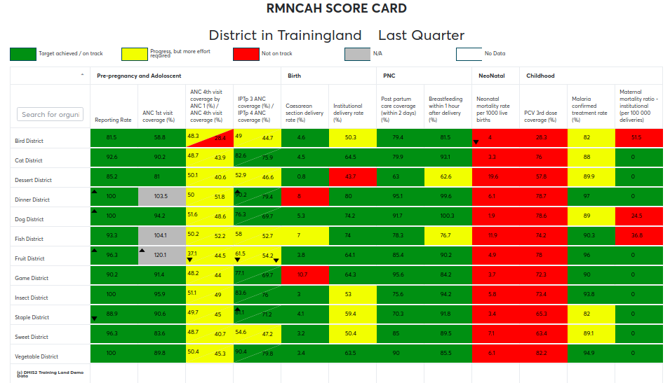

# Scorecard and demo server

## Introduction to scorecard

In public health setting such as Ministries of Health, scorecard offers
a useful and standardized method for analysis with traffic lights color
codes, combining related indicators into one table.

A scorecard can gives an overall view of the performance of a health
program such as a vaccination program, highlighting successes,
weaknesses, and areas for improvement.

There are two ways to create a scorecard: you can use:

  - The Scorecard app, as explained in this guide , or
  - The Pivot Table app, as explained in dhis2 website here:
    https://www.dhis2.org/node/243  

This guide  focuses mainly on the scorecard application, as explained
below; The difference between the two, is that the scorecard app is
tuned for advanced scorecard analysis and is developed and maintained by
HISP Community developers, while the Pivot Table App is for basic
scorecard analysis and is developed and maintained by the Dhis2 core
team.  With both scorecard app and pivot table app, you can download and
use your scorecard offline and share it on the DHIS2 dashboard. With a
scorecard app, you have more advanced control and power to easily create
and analyse multiple elements and dimensions in your data.  Additionally
the scorecard app gives an opportunity to cascade your analysis by
including bottleneck indicators in the scorecard dashboard as well as
analyses your data with broad spectrum of visualization tools, such as
pivot table, charts and maps.

 

## About demo server and scorecard meta-data

DHIS2 Scorecard team maintains a demonstration server
at [https://scorecard-dev.dhis2.org/demo](https://scorecard-dev.dhis2.org/demo).
This is by far the easiest way to try out Scorecard application in
DHIS2.

### Using DHIS2 Demo server

To use the scorecard demo server you will have to login into the server,
you can use the login credentials that are displayed on the login page
to login and explore the amazing features of the scorecard app.

### Scorecard metadata

The Scorecard borrows its meta-data from the general DHIS2 data source
and uses this to create a data store for ease of analysis. Scorecard
metadata such as indicators and indicator groups are managed using the
DHIS2 Indicator maintenance App. The Scorecard App is also integrated
with function maintenance App, used to create custom indicators. Custom
Indicators are indicators whose definition and calculation cannot easily
be created using the Indicator maintenance app in the DHIS2.  

        

