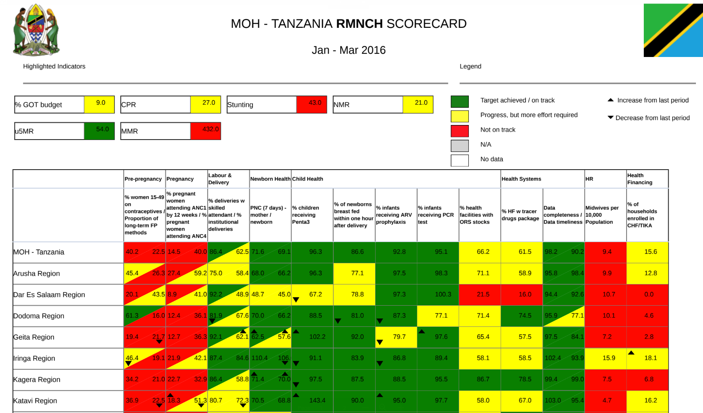
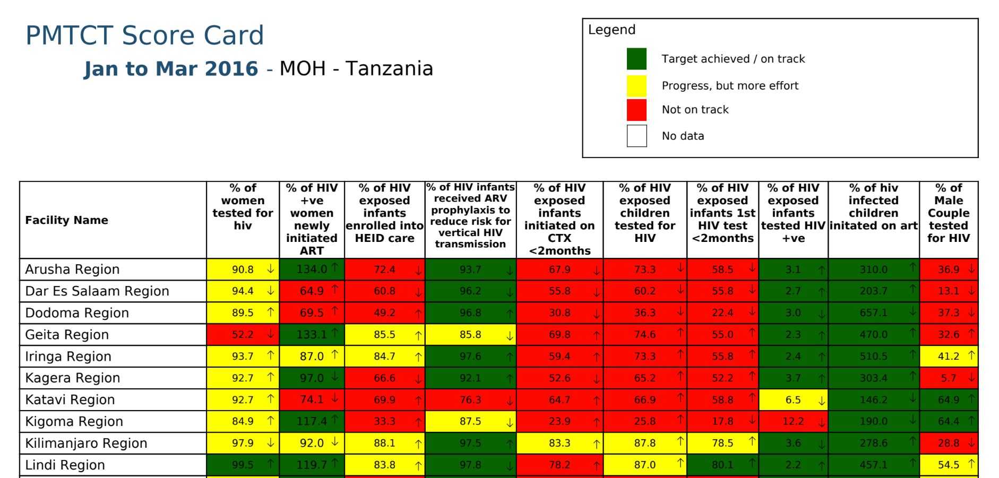
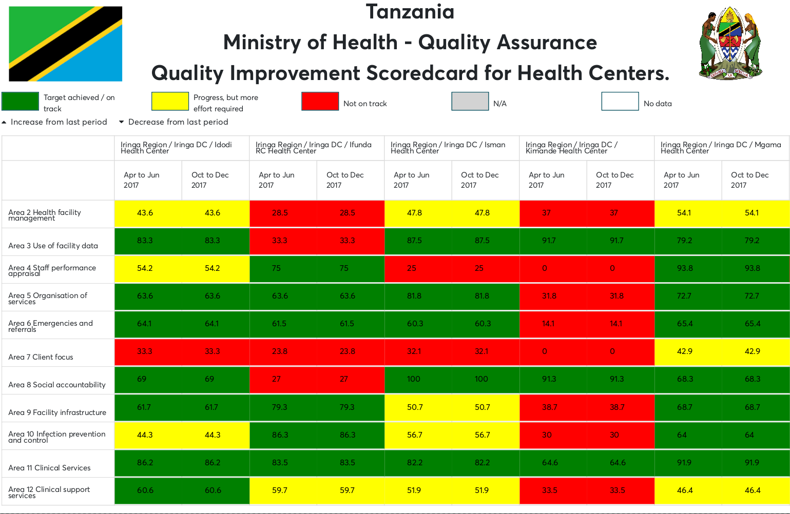

# Scorecard community and use cases

Scorecard development and implementation is community driven by HISP
Nodes and UNICEF Globally. As it is an open source software, it’s source
codes are available on github (https://github.com/hisptz/scorecard) for
contribution.

Contributions on scorecard community can be on the following areas:

1.  Development and Testing of scorecard application
2.  Documentation and translation of scorecard application
3.  Implementation of scorecard and experience sharing with community

## How to be part of the community

Scorecard development and implementation is a DHIS2 Community driven
development and implementation initiative comprising of collaborative
support of developers, implementers and translators from HISP Nodes,
Governments and Organizations using DHIS2. The best way to join the
DHIS2 Community is to sign up for the mailing lists.

<!-- PALD: this needs to be updated  -->
1.  Start by creating a user account at
    [Launchpad](https://launchpad.net/dhis2).
2.  If you are interested in the usage, setup or implementation of
    Scorecard you can sign up for the [user mailing list](https://launchpad.net/~dhis2-users).
3.  If you have questions about or want to follow the development
    process you can sign up for the [developer mailing list](https://launchpad.net/~dhis2-devs).
4.  If you want to participate in writing documentation signing up for
    the [documenter mailing list](https://github.com/dhis2/dhis2docs) would
    be useful.

Don't hesitate to get in touch if you are interested in using
Interactive scorecard for your organisation or government. We can be
reached through the contact details below. For technical questions or
questions related to scorecard implementation please sign up and use the
mailing lists as described above.

Email

  - HISP Tanzania <info@hisptanzania.org>
  - DHIS2 - <post@dhis2.org>
  - DHIS2 Academies - <post@dhis2.org>
  - The DHIS2 Online Academy - <onlineacademy@dhis2.org>

Websites

[https://hisptanzania.org/](https://hisptanzania.org/)

[http://www.hispuganda.org/](http://www.hispuganda.org/)

[https://dhis2.org/](https://dhis2.org/)

## Development and implementation

Interactive scorecard uses [JIRA](https://jira.dhis2.org/) for
issue tracking. You can use it to report bugs and request new features.
You can search for features to get an overview of which features make it
into each release.

## Documentation and Translations

<!-- PALD: this needs to be updated  -->
The Scorecard app documentation is available in google docs from here
[https://goo.gl/miojZ4](https://goo.gl/miojZ4).
You can recommend your changes by commenting on the topic of interest in
the document and share back your copy with tracked changes.

The Scorecard user interface is translated to a range of languages
including English, French and  Portuguese. Efforts for improving the
existing translations or adding new languages are much appreciated.

The easiest approach to translation is to download the google doc,
revise the existing translations and share the translated copy with
tracked changes to <info@hisptanzania.org>. You can use the same email
to request scorecard build with your translations reflected.

## Data use academy scorecard setup and use cases

### Rationale for adding scorecard app in data use academy

Scorecard has been added as one of the suite of analytics application in
DHIS2 array of analytics use cases, to enrich data use experience of
DHIS2 implementers.

The African Leaders Malaria Alliance is a groundbreaking coalition of 49
AFRICAN HEADS OF STATE AND GOVERNMENT working across country and
regional borders to eliminate malaria by 2030. They are leveraging
collective knowledge and influence to bring about action and
accountability as they fight one of their continent’s most devastating
diseases by:

  - Providing a forum to review progress and address challenges in
    meeting the malaria targets;
  - Implementing a monitoring and accountability system through the ALMA
    Scorecard for Accountability and Action to track results, identify
    bottlenecks, and facilitate appropriate action; and
  - Identifying and sharing lessons learned for effective implementation
    of national programs

Never before have African leaders come together in this way to solve a
crisis assailing our entire continent. The collaborative strategy has
proven itself to be an effective model for sustainable change as we
continue to engage new stakeholders, deepen relationships with key
decision makers, and work with ministers, NGOs, the private sector, and
other partners to maximize the value and impact of our work.

The overall objective of this the scorecard Info use academy is to
demonstrate how to analyze data using a scorecard using the scorecard.
Further the sessions:-

  - Demonstrates best practices of scorecard use
  - Explains the different features of the scorecard
  - Step by step use of scorecard

### Topics covered in dhis2 academy

Scorecard utilises training land setup with select few set of indicators
based on global RMNCH use cases to allow implementers to get first hand
experience of scorecard use cases and how it can be used as a powerful
real time tool for data use discussion, bottleneck analysis as well as
formulation of action and tracking of progress.

  - Launching and navigating the Scorecard app.
  - Different features of the scorecard.
  - Analyzing data using a scorecard
  - Explaining the different functions in the scorecard app
  - Downloading scorecard (excel and pdf)
  - Creating a new scorecard
  - Adding BNA indicators to scorecard

### Training materials and servers being used

The training materials used follow the standard DHIS2 Academy trainers
guides and in this case “Demo - Using a Scorecard.” The session follows
the standard Academy training approach with 1) a live demo session where
the trainer demonstrate and explain the features, and 2) a hands-­on
session with exercises where participants get to practice what they have
learned.

## Existing DHIS2 Scorecard app use cases

Countries and institution are slowly adopting use of interactive
scorecard application to leverage simplicity of scorecard creation
process as well as interactive user experience during analysis, among
the major functionalities cited as handy features that triggers adoption
of scorecard application uses includes:

1.  Ability to drill down and up the organization unit hierarchy, will
    supporting all possible organisation unit selections
2.  Ability to navigate scorecard across time as well as presentation of
    data with more than one period selection
3.  Ability to perform further analysis with charts, table and maps, as
    well as indicator dictionary overview on numerator and denominator
    definitions, calculations, data sources and related aspects of data
    quality such as deadlines of data sources.

Below are select few interactive scorecard application use cases across
various country implementation use cases.

### Tanzania's RMNCAH Scorecard

The Tanzania RMNCH scorecard was first produced using the African
Leaders Malaria Alliance (ALMA) RMNCH scorecard tool from January 2014
to June 2016; and from July 2016 to December 2016 the RMNCH scorecard is
being produced using the HMIS/DHIS2 RMNCH scorecard tool.

The Ministry of Health, Community Development, Gender, Elderly and
Children with technical support from the University of Dar es salaam is
now utilizing generic scorecard tool to support customization of the
Ministry’s scorecards with focus on revised RMNCH scorecard.

Among goals of moving to utilizing generic scorecard includes:

  - To fast track the scorecard generation, dissemination and use cycles
    and thereby introduce room for more data use, transparency and
    accountability at all levels (Council, Region, National) during all
    cycles of the scorecard generation.
  - Addition of supports of generic functionalities such as drill down
    on organization units, navigation across period and further analysis
    supported by generic scorecard.
  - Facilitate the ministry’s initiative of generating scorecards for
    different types of health sector interventions within HMIS/DHIS2.

The above scorecard have been implemented utilizing all possible
functionalities such as presentation of twin and related indicators
under single column. More initiative expected to support incorporation
of impact indicators presented separately on scorecard header
originating from census and surveys opposed to the majority of routine
data source indicators enlisted in scorecard rows.

### Tanzania's PMTCT Scorecard

The Ministry of Health and Social Welfare (MOHSW) through Prevention of
Mother to Child Transmission of HIV program (PMTCT) in its efforts to
improve PMTCT services at all levels, initiated development of PMTCT
scorecard with technical support from University of Dar es salaam. This
initiative aimed at improving quality of PMTCT services to active data
use with scorecard.

PMTCT scorecard contained 10 cascade indicators measuring PMTCT
interventions with the following rationales:

1.  To assess HIV Testing coverage among Pregnant women receiving ANC
    services at RCH
2.  To assess proportion of registered HIV positive women on ART.
    (Applicable for baseline values)
3.  Measure PMTCT retention and infant testing coverage
4.  Measures early MTCT, indicates effectiveness of PMTCT in the
    pregnancy period
5.  Coverage of testing at the end of breastfeeding
6.  To assess Impact of interventions up to the end of breastfeeding
7.  Measures overall MTCT rate up to the period of cessation of exposure
    to HIV virus through Breastfeeding

### Tanzania's QIP Scorecard

The Ministry of Health and Social Welfare (MOHSW) through Quality
assurance division aims at improving quality of service provision at
health facilities through assessment of four domain areas of service
provisions.

Among the key objectives of Quality Improvement plan (QIP) scorecard
includes:

  - Creation of transparent mechanism for tracking implementation of
    formulated quality improvement plans across four quarters for each
    annual assessment.
  - Systematically identify facilities areas of implementation
    challenges and gaps for re-strategizing and reprioritization of
    plans
  - Provide appropriate suggesting improvement steps to effectively
    implement formulated quality improvement plans

QIP Scorecard presents facility performance based on most recent
facility assessment or routine follow up information about.

### Uganda's RMNCH Scorecard

In November 2013, Uganda launched a Renewed, Sharpened and first
Integrated Reproductive, Maternal, Newborn and Child Health (RMNCH) plan
with clear goal, objectives, priorities and 5 strategic shifts in order
to employ new ways of combating RMNCH challenges. The plan aims to
accelerate reduction in maternal, newborn and child mortality and
improve on Uganda’s RMNCH indicators. In order, to track progress
against the ambitious goals and targets, a deliberate effort to track
performance must be invested.

Therefore, the endeavor of developing and implementing the Uganda RMNCH
Scorecard is in line with global initiatives including A Promise Renewed
(APR), UN Commission on Information and Accountability among others.
Under the APR initiative, the Ministry of Health progressively
institutionalizes a national and sub national RMNCH scorecard based on
routine Health Management Information System (HMIS) data and the
District Health Information System (DHIS2) platform.. The scorecard is
also aimed to facilitate health facilities to review their performance
within the quality improvement framework.

