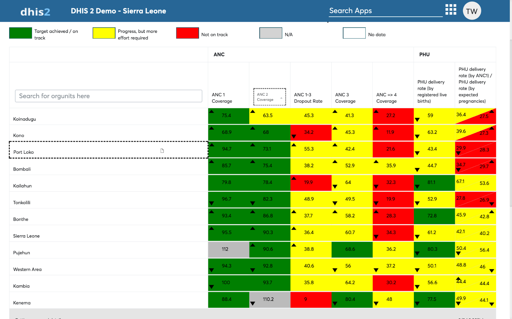

# Scorecard layouts, headers and legends

## Layout change with drag-n-drop

When viewing the scorecard you can change layout by simply clicking at
column labels(text), and dragging it to a row heading.

This also works when dragging a row heading to a column heading.

> **NOTE**
>
> Dashed lines indicate the drag n drop zones.

## Scorecard header

The scorecard header appears on the top of scorecard. To create custom
header and add additional branding, see chapter 9.2.1 “Branding
scorecard header”.

The scorecard header is by default composed with the Scorecard Title,
the selected Organization Unit(s) and the selected period(s)

> **NOTE**
>
> Scorecard header can be branded from basic text with bold, color and
font type, to full blown customized header with national flags, pictures
and other branding supported with HTML5.

## Scorecard legend

The scorecard legend is displayed under the scorecard header. By default
all scorecard will start with legend displayed.

The scorecard legend gives meaning on the colors displayed on the
scorecard visualization.

> **NOTE**
>
> Gray color for Not Applicable (N/A) is used when values falls out of
range of the minimum and maximum of existing color code classes.

White color code is used when there’s no value (returned results are
empty/null not zero)

 Important

Error loading data is among the errors that can be notified on the
legend, this error can happen when viewing a scorecard which any the
data selection made has been deleted in the system. Thus it should be
noted that the scorecard app requires data selections that exist in the
dhis2 system and deleting data selection involved in scorecards shall
lead to an error.

## Column headers, hints and tool-tips

Column headers appear on top of every column. By default, a column
header is the conventional name of the particular data selection.

#

Figure 5.4-A: The column header of a scorecard with hints.

> **NOTE**
>
> The most common errors are internal server errors or failed network
operations while loading data, oftenly abbreviated with error codes
(409, 404, 502, etc..). Check with your system administrator on
indicators and the server setup to resolve the errors.

Tooltips appear when you hover on the cells that have deviated from the
previous period selection. The tooltip will brief on the previous value,
the deviation and the minimum value that makes a deviation count as
significant.

#

